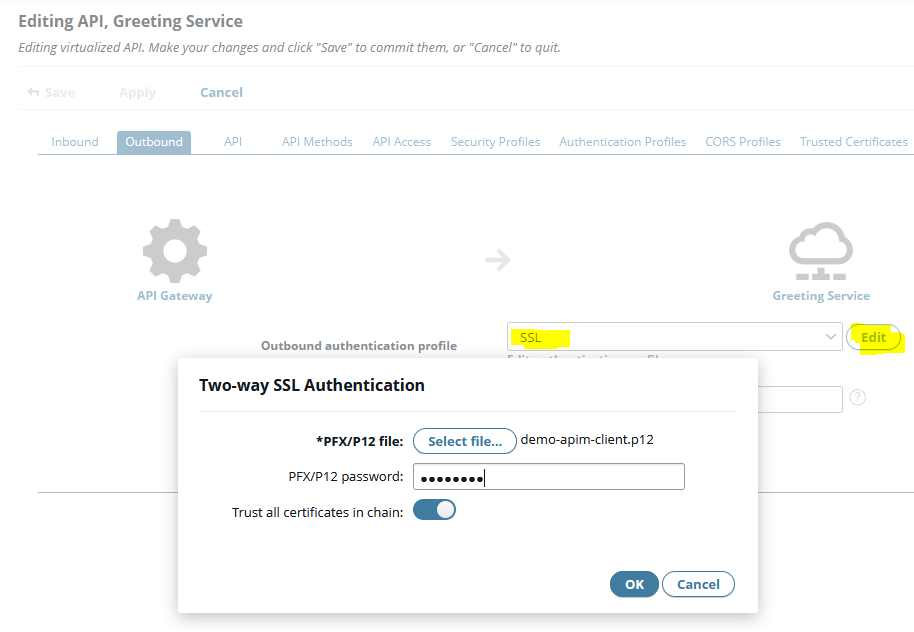

# Virtualize API with API Manager

## Pre-Requisites

* API Manager must be enabled on the gateway
* OAuth2 server must be enabled on the gateway
* Policy for token introspect must be imported (see below)
* Create sample users in the user store (via PolicyStudio)

### Token Introspect

The _Simple Greeting Service_ is secured with OAuth2.
The service requires the user identifier and the scopes of a received token to authorize the request.

To validate a received token and to get the detail information of the token, the service initiates a token introspect.
Therefore the token introspect endpoint of the Authorization Server will be invoked.
This is a build-in feature of the [Quarkus OAuth2](https://quarkus.io/guides/security-oauth2) module.

The API Manager includes a build-in OAuth2 authorization server.
Unfortunately, it doesn't provide a token introspect endpoint.
Due to the flexibility of PolicyStudio, the token introspect endpoint can be implemented easily.

To use the _Simple Greeting Service_ with the OAuth2 server of the API Manager, the token introspect configuration fragment must be implemented (`src/policies/oauth2-token-introspect.xml`).

### Sample Users

To simplify the authentication of users, a fixed set of sample users must be created within PolicyStudio.
These users will be used for the login screen of the Authorization Server.

### API Manager Deployment

To apply the changes within PolicyStudio, the project must be deployed to an API Gateway instance.

## Create Backend API

To create the backend API, import a new OpenAPI (aka Swagger) specification.

Select the `src/openapi/greeting-service/reference/greeintg-service.json` file, select the target organization and give the API a proper name.

## Create Frontend API

To crate the frontend API, select the newly created backend API.

Because of the backend is secured with mTLS, the trusted certificates must be imported (`src/certs/demo-root-ca.crt`).

The security between the API Manager and the backend is configured on the _Outbound_ tab.
Select SSL and specify the client certificate of the API Manager via the _Edit_ button.
Select the `src/certs/demo-apim-client.p12` file and use the password `changeme`.

To secure the API with OAuth2, switch to the _Inbound_ tab and select _OAuth_ for inbound security.
Configure the scopes to `greetings,greetings.set` and disable the removal of credentials.

NOTE: For authorization in the backend, the access token must be forwarded by the API Manager to the backend.

Last but not least define the base path of the API `/greetings/v1`.

## Use API

To use the API, create a new application.

As the API is not published yet, the application must be created in the same organization as the API.
In th _API Access_ section add the newly created frontend API.

After creation of the App, the OAuth credentials have to be configured.
As we require a user authentication, the App must be of type _Public_.

Enter the JavaScript Origins and redirect URLs.

NOTE: For production, restrict the origins should be restricted to required sites only.

NOTE: To enable testing via the API Portal, the redirect URL of the API Portal must be added `https://{portal-server}/cb`.

